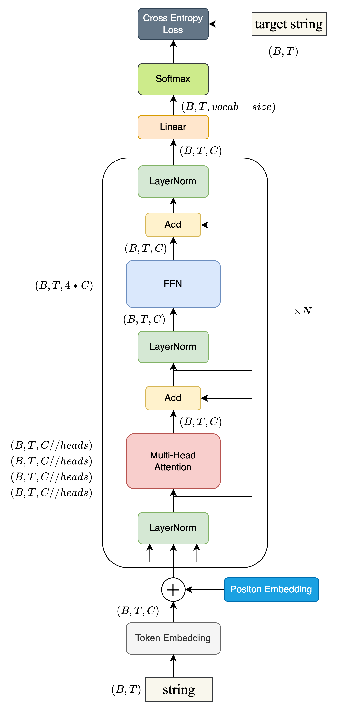

🎯 这个文件夹是关于 Andrej Karpathy 在Yoube 的视频 [Let's build GPT: from scratch, in code, spelled out.](https://www.youtube.com/watch?v=kCc8FmEb1nY) 的笔记。

🗂️ 针对视频里所用的 Google colab 我加上了自己的理解和一些补充知识：

- [gpt_dev_注释版.ipynb](gpt_dev_注释版.ipynb) 在 Karpathy 视频里的 google colab 的基础上加了注释和解释
- [scaling_dot_products.md](../../Learning_Notes/scaling_dot_products.md) 是关于 scaling dot products 的数学推导
- [pics/nanoGPT_train.png](pics/nanoGPT_train.png) 是 nanoGPT 的 模型架构以及维度变换

在 Github 发现了一个非常详细的 Repo 大家由需要可以点击跳转 [nanoGPT-Tutorial-CN
](https://github.com/cfcys/nanoGPT-Tutorial-CN)

其他关于 LLM 从零构建的repo, 以下皆是从大佬的 github fork而来，作为学习资料 

- [LLMs-from-scratch-pq](https://github.com/pengqianhan/LLMs-from-scratch-pq)
- [llama3-from-scratch-pq](https://github.com/pengqianhan/llama3-from-scratch-pq)